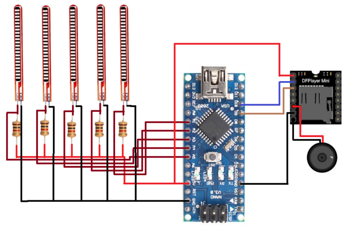
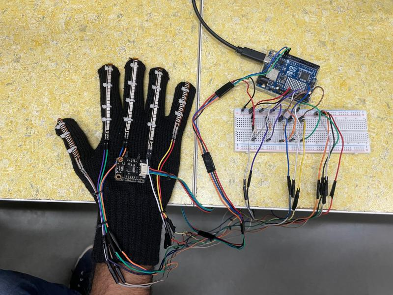

# Sign Language to Text Conversion System using Flex Sensors and Arduino 

## Introduction

This project aims to address the communication gap between the deaf and dumb community in India by converting sign language into Speech. The system utilizes flex sensors to monitor the amount of bend on the fingers, which are commonly used in sign language gestures. The flex sensors change resistance depending on the finger's bend, and the data from these sensors is sent to the Arduino, acting as the control unit.

The Arduino then performs analog-to-digital conversion on the received sensor data, compares it with the pre-stored values corresponding to specific sign language gestures, and finally Playing corresponding message Audio File. This system allows non-sign language users to understand and communicate with the deaf and dumb population easily.

# Circuit Diagram

## Components

- Flex Sensors: These sensors are used to detect the amount of bend on the fingers during sign language gestures.

- Arduino Board: The Arduino acts as the control unit, receiving data from the flex sensors, processing it, and displaying the results on the LCD.

- DF Mini Player:  Module designed to play audio files from a microSD card. It supports various audio formats, including MP3, WAV, and WMA. 

- Power Supply: A suitable power supply to provide the necessary voltage for operating the system.

- Speaker

## How It Works

1. Flex sensors are attached to the fingers of the user, and they change their resistance based on finger bend.

2. The analog signals from the flex sensors are fed into the Arduino Uno.

3. The Arduino performs analog-to-digital conversion on the incoming signals to convert them into a digital format.

4. The Arduino compares the obtained digital values with pre-stored values representing different sign language gestures.

5. Once a match is found, the corresponding audio file is played stored in SD card .

# Project Image

## Setup and Installation

1. Connect the flex sensors to the appropriate analog input pins on the Arduino board.

2. Connect the DF Mini Player to the Arduino, ensuring proper connections for data and control signals.

3. Upload the Arduino code (sketch) responsible for reading sensor data, processing it, and playing the audio file to the Arduino board.

4. Calibrate the system by capturing and storing the resistance values for different finger bend angles during sign language gestures.

5. Once the calibration is complete, the system is ready to convert sign language gestures to speech.

## Usage

1. The user wears the flex sensors on their fingers.

2. The flex sensors continuously measure the finger bend angles and send the data to the Arduino.

3. When the user performs a sign language gesture, the Arduino processes the sensor data and converts it into Audio File.

4. The audio is played allowing non-sign language users to understand the intended message.

## Benefits

- Facilitates communication between the deaf and dumb community and non-sign language users.

- Enables the deaf and dumb population to express themselves more effectively.

- Increases inclusivity and accessibility for the deaf and dumb population in various settings.

## Conclusion

The Sign Language to Text Conversion System using Flex Sensors and Arduino provides a valuable solution to bridge the communication gap between the deaf and dumb community and the rest of society. By converting sign language gestures into easily understandable text, this system enhances communication and fosters inclusivity, ultimately contributing to a more connected and empathetic society.
